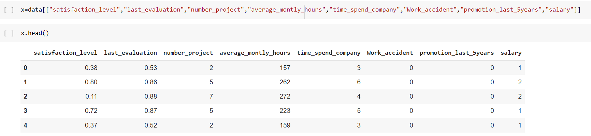

# Implementation-of-Decision-Tree-Classifier-Model-for-Predicting-Employee-Churn

## AIM:
To write a program to implement the Decision Tree Classifier Model for Predicting Employee Churn.

## Equipments Required:
1. Hardware – PCs
2. Anaconda – Python 3.7 Installation / Jupyter notebook

## Algorithm
1. Import dataset and print dataset info
2. check for null value
3. Map numerical values for salary feature
4. Assign x and y values
5. Split the dataset into train and test sets
6. Import decisiontree classifier and fit it in the dataset
7. Find accuracy and predict values

## Program:
```
/*
Program to implement the Decision Tree Classifier Model for Predicting Employee Churn.
Developed by: 212220040162
RegisterNumber: M.Subiksha

##program##
import pandas as pd
data=pd.read_csv("/content/Employee.csv")
data.head()
data.info()
data.isnull().sum()
data["left"].value_counts()
from sklearn.preprocessing import LabelEncoder
le=LabelEncoder()
data["salary"]=le.fit_transform(data["salary"])
data.head()
x=data[["satisfaction_level","last_evaluation","number_project","average_montly_hours","time_spend_company","Work_accident","promotion_last_5years","salary"]]
x.head()
y=data["left"]
y.head()
from sklearn.model_selection import train_test_split
x_train,x_test,y_train,y_test=train_test_split(x,y,test_size=0.2,random_state=10)
from sklearn.tree import DecisionTreeClassifier
dt=DecisionTreeClassifier(criterion="entropy")
dt.fit(x_train,y_train)
y_pred=dt.predict(x_test)
from sklearn import metrics
accuracy=metrics.accuracy_score(y_test,y_pred)
accuracy
dt.predict([[0.5,0.8,9,260,6,0,1,2]])
*/
```

## Output:





## Result:
Thus the program to implement the  Decision Tree Classifier Model for Predicting Employee Churn is written and verified using python programming.
